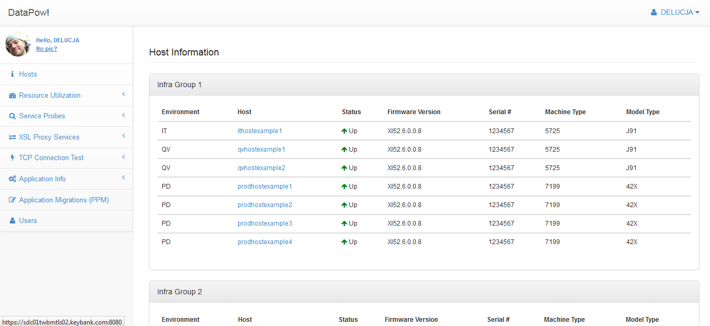
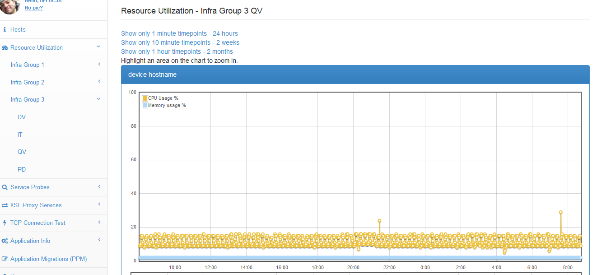
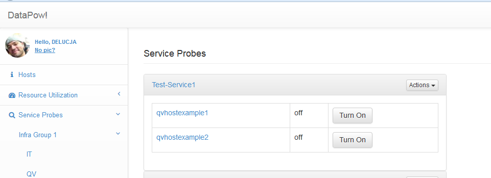
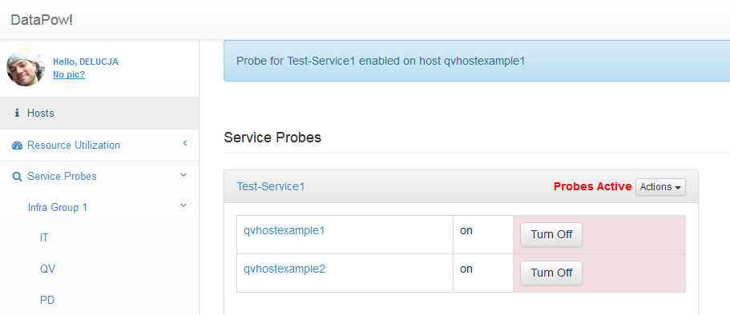
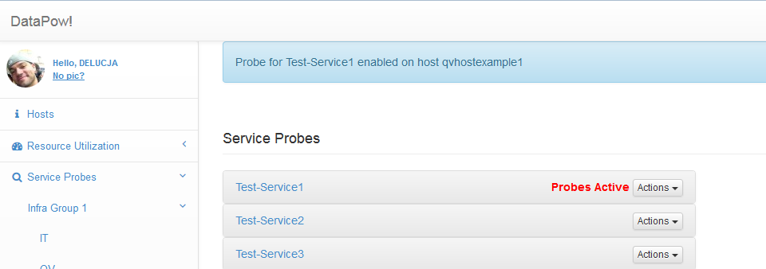
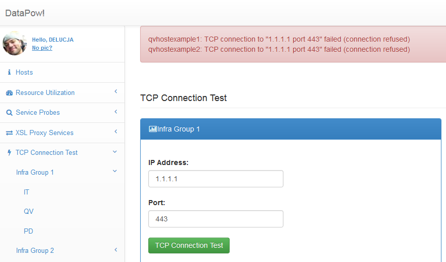
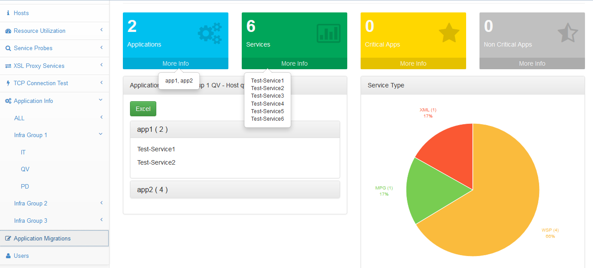

DataPow
=======

A web admin tool powered by Ruby on Rails and Twitter Bootstrap to manage various DataPower tasks from a centralized site. DataPow is efficient at executing tasks on multiple DataPower devices at the same time. No more logging into each DataPower device individually and clicking 10 times per device to achieve a simple task. The calls to the DataPower devices are made via soap requests to the XML management interface. The SOAP constructors are modular and reusable, so when new features are needed, you spend less time developing and constructing soap messages.

There are various roles mapped and controlled within DataPow, for example Developers, Administrators, Operators, Enhanced Developers, etc. The different roles are mapped to certain functions and features within the tool to limit and control access. For example, a developer may only have read access and not write access to higher DataPower environments (QV or PROD), but with role mapping in this tool, a developer can enable probes in higher environments for troubleshooting without actually having write access to the DataPower devices themselves. Or an operations support team would only have access to the DataPow tool to enable probes in production, whilst ensuring production control is in place (you better have a change record foo!!).

Here is a snapshot of the 'hosts' page. Hostnames and serial numbers are overwritten with dummy data, but the page shows pertinent information related to each device. This is useful to get the health status and general info / inventory of devices. The hosts displayed on the page are grouped in high-level buckets, so there are multiple groups in this page and below it. I only am showing the first bucket to keep it simple.

Here is a snapshot of the 'Resource Utlization' page. The memory and cpu resources are captured and written to a database via a cron job and displayed to the page. The interval links allow you to specify minute (up to 24 hours), 10 minute (up to 2 weeks), and hourly (up to 2 months). This is useful for capacity planning, load testing, and root cause analysis.

Here are snapshots of the 'Service Probes' page. Enable and disable debug service probes on multiple devices quickly and easily within DataPow.

Here is a snapshot of the 'TCP Connection Test' page. DataPower administrators often get asked to perform TCP connection tests from DataPower to determine if remote hosts / ports are open and to validate network connectivity. With DataPow, it is so simple. No more logging into every device and running TCP connection tests manually. Allow the application teams or someone else to run the tests themselves from a centralized console.

Here are snapshots of the 'Application Info' page. Get a birds eye view of application foot prints in DataPower.

